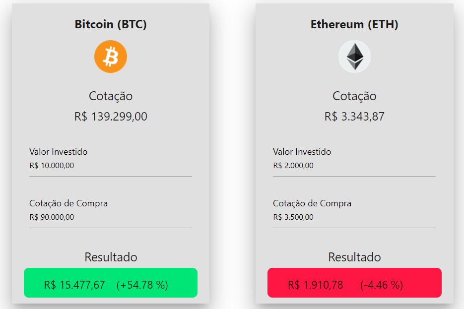

# cryptocurrency-monitor
Application for monitoring the ROI of cryptocurrency investments, in BRL (Brazilian Real).

The application is implemented on Github pages for Bitcoin(BTC) and Ethereum (ETH), and can be easily adapted to show other cryptocurrencies and fiat currencies. 

You can access the application here: https://brunovaletta.github.io/cryptocurrency-monitor/

Here is a preview: 

